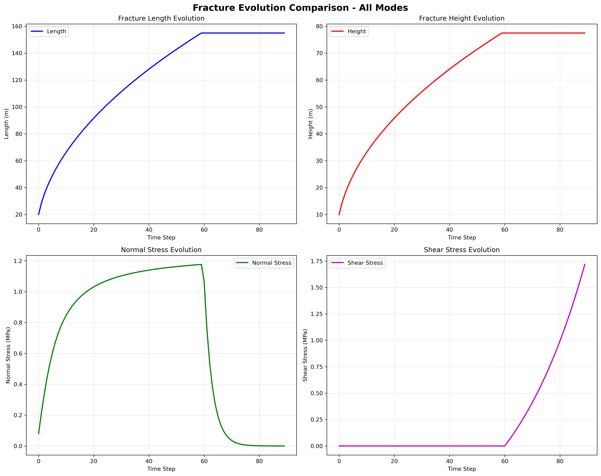

# DDM3D Examples

This directory contains comprehensive examples demonstrating different fracture modes and their DAS (Distributed Acoustic Sensing) responses using the DDM3D package.

## Overview

The examples showcase four different fracture scenarios, each representing different geological and engineering conditions:

1. **[Opening Mode Base](opening_mode_base/)** - Vertical fracture with pure opening (0° inclination)
2. **[Opening Mode Incline](opening_mode_incline/)** - Inclined fracture with pure opening (-30° inclination)
3. **[Shear Mode Incline](shear_mode_incline/)** - Inclined fracture with pure shear slip (-30° inclination)
4. **[Mixed Mode Incline](mixed_mode_incline/)** - Inclined fracture with combined opening and shear (-30° inclination)

## Quick Start

Each example directory contains:
- **Complete Python script** (`run_*.py`) - Ready to run simulation
- **Detailed README.md** - Comprehensive documentation
- **Command-line interface** - Flexible parameter control

### Basic Usage
```bash
# Navigate to any example directory
cd examples/opening_mode_base

# Run the simulation
python run_opening_mode_base.py

# With custom parameters
python run_opening_mode_base.py --recalculate --gauge_length 5.0
```

## Definition of Orientation (o1, o2, o3)

The DDM3D package uses a custom orientation system to define fracture orientations, avoiding confusion with geological strike-dip-yaw conventions:

- **o1 (Rotation around Z-axis)**: A plane with 0° in o1 is parallel to the positive X direction. Positive rotation is counter-clockwise when viewed from above.
- **o2 (Rotation around X-axis)**: A plane with 0° in o2 is parallel to the positive Z direction. Positive rotation is counter-clockwise when viewed from the positive X direction.
- **o3 (Rotation around Y-axis)**: A plane with 0° in o3 has either its length or width vector parallel to the XY plane. Positive rotation is counter-clockwise when viewed from the positive Y direction.

This orientation system provides precise control over fracture geometry while maintaining consistency with the Cartesian coordinate system used throughout the simulation.

## Example Comparison

| Example | Fracture Orientation | Stress Mode | Use Case |
|---------|---------------------|-------------|----------|
| **Opening Mode Base** | 0°, 0°, 0° | Normal stress only | Hydraulic fracturing in vertical formations |
| **Opening Mode Incline** | -30°, 0°, 0° | Normal stress only | Hydraulic fracturing in inclined formations |
| **Shear Mode Incline** | -30°, 0°, 0° | Shear stress only | Fault slip monitoring |
| **Mixed Mode Incline** | -30°, 0°, 0° | Combined stresses | Complex fracture systems |

## Common Parameters

All examples support the following command-line options:

- `--recalculate` or `-r`: Force recalculation instead of loading from HDF5 files
- `--gauge_length` or `-gl`: Channel spacing for interpolation (default: 10.0 meters)
- `--scale` or `-s`: Scale factor for the data for plotting (default: 20.0)

## Output Structure

Each example generates:

### HDF5 Files
- `./results/{mode}_fiber_1.h5` - Fiber 1 data
- `./results/{mode}_fiber_2.h5` - Fiber 2 data  
- `./results/{mode}_fiber_3.h5` - Fiber 3 data

### Plots
- `./results/{mode}_fiber_1_EYY_U.png` - Strain contour plot
- `./results/{mode}_fiber_1_EYY_U_Rate.png` - Strain rate contour plot

## Fiber Network

All examples use the same DAS fiber network:

1. **Fiber 1**: Across the fracture (strongest response)
   - Start: (50, 100, 0), End: (50, -100, 0)
   - 200 channels, 2m spacing

2. **Fiber 2**: Parallel to fracture (close)
   - Start: (50, 10, -100), End: (50, 10, 100)
   - 200 channels, 2m spacing

3. **Fiber 3**: Parallel to fracture (far)
   - Start: (50, 50, -100), End: (50, 50, 100)
   - 200 channels, 2m spacing

## Fracture and Fiber Configuration

Each example includes detailed 3D configuration diagrams showing the fracture and fiber layout:

- **Opening Mode Base**: `opening_mode_base/figures/base_fracture_fiber_config.png`
- **Opening Mode Incline**: `opening_mode_incline/figures/incline_fracture_fiber_config.png`
- **Shear Mode Incline**: `shear_mode_incline/figures/incline_fracture_fiber_config.png`
- **Mixed Mode Incline**: `mixed_mode_incline/figures/incline_fracture_fiber_config.png`

These figures show:
- **3D Perspective**: Multiple viewpoints of the simulation domain
- **Fracture Geometry**: Elliptical fracture with orientation parameters
- **Fiber Layout**: Three-fiber monitoring network
- **Coordinate System**: Clear X, Y, Z axis labeling
- **Distance Measurements**: Specific distances between components

## Fracture Geometry Evolution and Stress Profiles

Each example README includes actual evolution plots showing fracture geometry and stress evolution over time. The simulation uses synthetic geometry evolution and stress profiles derived from pure mathematic approximations, which mimics the real-world cases. The code is capable and the users are encouraged to use physics-based fracture geometry and stress evolution data. These plots help visualize:

### Fracture Geometry Evolution
- **Length and Height**: Square root growth pattern over time
- **Element Size**: Dynamic sizing to maintain grid resolution
- **Growth Rates**: Time-dependent growth characteristics

### Stress Evolution
- **Normal Stress**: Arctangent increase during growth (0-60 time steps (minutes in this simulation), the code does not enforce the unit of time steps), exponential decay after shut-in
- **Shear Stress**: Zero during growth (0-60 time steps (minutes in this simulation), the code does not enforce the unit of time steps), exponential increase after shut-in (for shear/mixed modes)
- **Stress Interactions**: Combined effects in mixed mode scenarios

### All Modes Comparison



This comparison plot shows the evolution patterns for all four fracture modes, highlighting the differences in stress evolution between opening, shear, and mixed modes.

### Individual Mode Plots
Each example directory contains its own evolution plots:
- **Opening Mode Base**: 
  - `opening_mode_base/figures/opening_mode_base_dimensions.png` - Fracture dimensions
  - `opening_mode_base/figures/opening_mode_base_stresses.png` - Normal stress evolution
- **Opening Mode Incline**: 
  - `opening_mode_incline/figures/opening_mode_incline_dimensions.png` - Fracture dimensions
  - `opening_mode_incline/figures/opening_mode_incline_stresses.png` - Normal stress evolution
- **Shear Mode Incline**: 
  - `shear_mode_incline/figures/shear_mode_incline_dimensions.png` - Fracture dimensions
  - `shear_mode_incline/figures/shear_mode_incline_stresses.png` - Shear stress evolution
- **Mixed Mode Incline**: 
  - `mixed_mode_incline/figures/mixed_mode_incline_dimensions.png` - Fracture dimensions
  - `mixed_mode_incline/figures/mixed_mode_incline_stresses.png` - Normal and shear stress evolution

## Technical Details

### Simulation Parameters
- **Time Steps**: 90 (60 before shut-in + 30 after shut-in)
- **Fracture Growth**: Square root growth pattern
- **Material Properties**: 10 GPa shear modulus, 0.25 Poisson's ratio
- **Element Count**: 10 × 10 elements per fracture

### Stress Profiles
- **Normal Stress**: Arctangent increase during growth (0-60 time steps (minutes in this simulation), the code does not enforce the unit of time steps), exponential decay after shut-in
- **Shear Stress**: Zero during growth (0-60 time steps (minutes in this simulation), the code does not enforce the unit of time steps), exponential increase after shut-in
- **Stress Scales**: 0.8 MPa normal, 1.0 MPa shear

### DAS Response
- **Strain Calculation**: Based on displacement gradients
- **Strain Rate**: Time derivative of strain
- **Interpolation**: Dynamic gauge length support
- **Visualization**: Time-space contour plots

## Performance Considerations

### Memory Management
- **HDF5 Storage**: Efficient data storage and retrieval
- **Plot Management**: Automatic figure cleanup
- **Recalculation Control**: Load from saved data when possible

### Optimization Tips
- Use `--gauge_length` or `-gl` to control interpolation resolution
- Use HDF5 files for repeated runs (avoid `--recalculate`)
- Monitor memory usage for large simulations
- Use appropriate time step counts for your system

## Troubleshooting

### Common Issues
1. **Import Errors**: Ensure DDM3D package is properly installed
2. **Memory Issues**: Reduce time steps or use smaller gauge_length
3. **Plot Errors**: Check matplotlib backend and display settings
4. **File Not Found**: Verify working directory and file paths

### Getting Help
- Check individual example README files for detailed documentation
- Review the main DDM3D documentation
- Check GitHub issues for known problems
- Contact the development team for support

## Contributing

To add new examples:
1. Create a new directory following the naming convention
2. Include a complete Python script with command-line interface
3. Add comprehensive README.md documentation
4. Follow the established code structure and patterns
5. Test thoroughly before submitting

## License

These examples are part of the DDM3D project and are released under the MIT License. See the main project LICENSE file for details.
