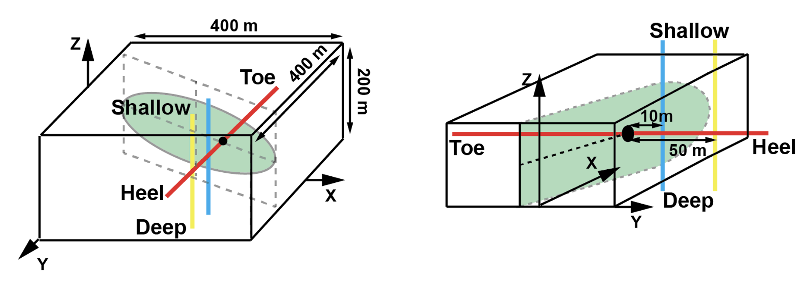
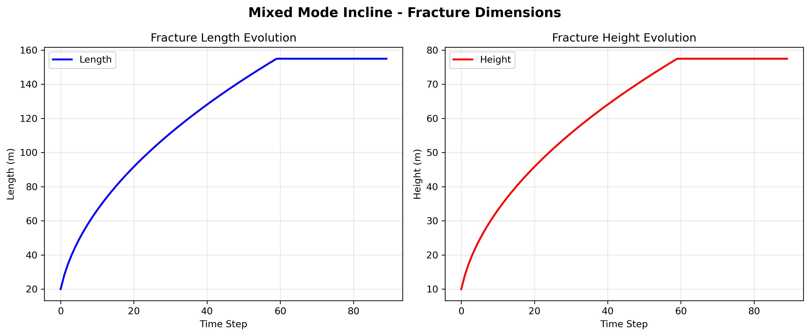
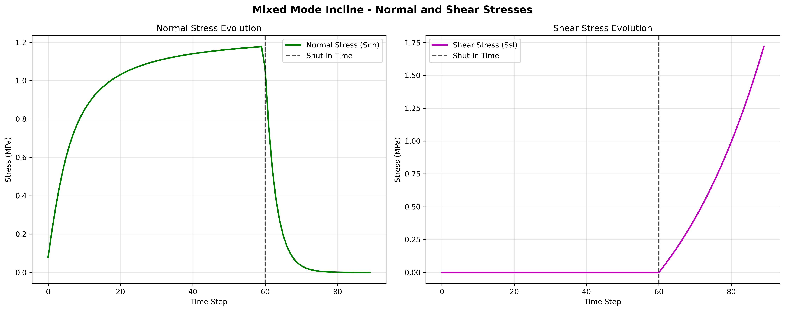

# Mixed Mode Incline Example

This example demonstrates the **mixed mode with inclination** - a fracture inclined at -30 degrees that experiences both shear stress and normal stress, representing combined hydraulic fracturing and fault slip behavior.

## Overview

- **Fracture Orientation**: -30 degrees (inclined)
- **Stress Mode**: Combined shear and normal stress (mixed mode)
- **Fracture Center**: (0, -28.87, 0) - offset due to inclination
- **Time Steps**: 90 (60 before shut-in + 30 after shut-in)
- **Fracture Growth**: Square root growth pattern

## Parameters

### Fracture Geometry
- **Length Scale**: 20.0 m
- **Height Scale**: 10.0 m
- **Element Count**: 10 × 10 elements
- **Growth Pattern**: `length = 20 * sqrt(time)`, `height = 10 * sqrt(time)`
- **Inclination**: -30 degrees (o1 = -30°)

### Stress Profile
- **Normal Stress (Snn)**: 
  - Before shut-in: `0.8e6 * arctan(time)` (increasing)
  - After shut-in: Exponential decay
- **Shear Stress (Ssl)**: 
  - Before shut-in: 0 (no slip)
  - After shut-in: `-1.0e6 * exp(0.01 * time) + 1.0e6` (increasing slip)
- **Shear Stress (Ssh)**: 0 (no out-of-plane shear)

### Material Properties
- **Shear Modulus**: 10 GPa
- **Poisson's Ratio**: 0.25

## Fiber Network

Three DAS fibers are deployed for monitoring:

1. **Fiber 1**: Across the fracture
   - Start: (50, 100, 0)
   - End: (50, -100, 0)
   - Channels: 200

2. **Fiber 2**: Parallel to fracture (close)
   - Start: (50, 10, -100)
   - End: (50, 10, 100)
   - Channels: 200

3. **Fiber 3**: Parallel to fracture (far)
   - Start: (50, 50, -100)
   - End: (50, 50, 100)
   - Channels: 200

## Fiber and Fracture Dimensions

The following figure illustrates the fracture and fiber configuration for the mixed mode incline case.



- **Fracture Center**: (0, -28.87, 0)
- **Fracture Orientation**: o1=-30°, o2=0°, o3=0°
- **Block Dimensions**: 400m × 400m × 200m
- **Fiber Layout**: Three fibers positioned to capture different aspects of the inclined fracture response

## Usage

### Basic Usage
```bash
python run_mixed_mode_incline.py
```

### With Custom Parameters
```bash
# Force recalculation
python run_mixed_mode_incline.py --recalculate

# Custom gauge length for interpolation
python run_mixed_mode_incline.py --gauge_length 5.0

# Both options
python run_mixed_mode_incline.py --recalculate --gauge_length 5.0
```

### Command Line Options
- `--recalculate` or `-r`: Force recalculation instead of loading from HDF5 files
- `--gauge_length` or `-gl`: Channel spacing for interpolation (default: 10.0 meters)
- `--scale` or `-s`: Scale factor for the data for plotting (default: 20.0)

## Output

The script generates:

### HDF5 Files
- `./results/mixed_mode_incline/mixed_mode_incline_fiber_1.h5`
- `./results/mixed_mode_incline/mixed_mode_incline_fiber_2.h5`
- `./results/mixed_mode_incline/mixed_mode_incline_fiber_3.h5`

### Plots
- `./results/mixed_mode_incline/mixed_mode_incline_fiber_1_EYY_U.png` - Strain contour
- `./results/mixed_mode_incline/mixed_mode_incline_fiber_1_EYY_U_Rate.png` - Strain rate contour

## Fracture Geometry Evolution and Stress Profiles

The simulation uses synthetic geometry evolution and stress profiles derived from pure mathematic approximations, which mimics the real-world cases. The code is capable and the users are encouraged to use physics-based fracture geometry and stress evolution data. The following plots show the fracture geometry and stress evolution for the mixed mode incline case:

### Fracture Dimensions Evolution



**Fracture Geometry Characteristics:**
- **Length**: Square root growth from 0 to ~20m over 60 time steps, then constant
- **Height**: Square root growth from 0 to ~10m over 60 time steps, then constant
- **Growth Pattern**: Highest growth rate at early times, decreasing as fracture grows
- **Inclination Effect**: Same growth pattern as base case, but with -30° orientation in o1, o2, o3

### Normal and Shear Stress Evolution



**Stress Characteristics:**
- **Normal Stress (Snn)**: 
  - Increases with arctangent function during growth phase (0-60 time steps (minutes in this simulation), the code does not enforce the unit of time steps)
  - Exponential decay after shut-in (60-90 time steps)
  - Peak stress at shut-in time
- **Shear Stress (Ssl)**: 
  - Zero during growth phase (0-60 time steps (minutes in this simulation), the code does not enforce the unit of time steps)
  - Exponential increase after shut-in (60-90 time steps)
  - Represents fault slip activation
- **Shear Stress (Ssh)**: Zero throughout (no out-of-plane shear)
- **Combined Effect**: Most complex stress pattern with both opening and shear components

## Expected Results

### Fracture Behavior
- **Combined Opening and Slip**: Both normal opening and shear slip
- **Complex Stress Field**: Interaction between opening and shear stresses
- **Asymmetric Growth**: Fracture grows with inclination, creating complex stress field
- **Stress Evolution**: Normal stress increases during growth, shear stress increases after shut-in

### DAS Response
- **Fiber 1** (across fracture): Strong response with complex pattern due to combined stresses
- **Fiber 2** (close parallel): Moderate response, affected by both opening and shear
- **Fiber 3** (far parallel): Weak response, less affected by combined stresses

### Time-Space Patterns
- **Strain**: Complex patterns due to combined opening and shear
- **Strain Rate**: High rates during both opening and slip phases
- **Spatial Distribution**: Complex asymmetric pattern due to fracture inclination and combined stresses

## Physical Interpretation

This example represents a **complex fracture system** with:
- **Hydraulic Fracturing**: Normal stress component for fracture opening
- **Fault Activation**: Shear stress component for fault slip
- **Combined Behavior**: Both hydraulic and tectonic processes
- **Realistic Scenario**: Most realistic representation of natural fracture systems

## Comparison with Other Modes

- **vs. Opening Mode Base**: This has both shear and normal stress vs normal stress only
- **vs. Opening Mode Incline**: This has both shear and normal stress vs normal stress only (both inclined)
- **vs. Shear Mode Incline**: This has both shear and normal stress vs shear stress only (both inclined)

## Key Characteristics

### Mixed Mode Behavior
- **Opening Phase**: Normal stress dominates during initial growth
- **Slip Phase**: Shear stress dominates after shut-in
- **Combined Effects**: Interaction between opening and shear processes
- **Complex Response**: Most complex strain patterns of all modes

### DAS Response Characteristics
- **Combined Strain Patterns**: Due to both opening and shear displacement
- **Asymmetric Patterns**: Due to inclined fracture geometry
- **Complex Signatures**: Distinctive strain patterns for mixed mode behavior
- **Spatial Complexity**: Most complex spatial distribution of all modes

## Scientific Applications

This example is particularly relevant for:
- **Complex Fracture Systems**: Understanding combined hydraulic and tectonic processes
- **Induced Seismicity**: Monitoring both hydraulic fracturing and fault activation
- **Fault-Hydraulic Interaction**: Understanding interaction between faults and hydraulic systems
- **Realistic Modeling**: Most realistic representation of natural fracture systems
- **Multi-Physics Processes**: Understanding coupled hydraulic and mechanical processes

## Geological Context

### Complex Fracture Systems
- **Hydraulic-Tectonic Interaction**: Combined hydraulic and tectonic processes
- **Fault-Hydraulic Systems**: Interaction between faults and hydraulic systems
- **Multi-Physics Processes**: Coupled hydraulic and mechanical processes
- **Realistic Scenarios**: Most realistic representation of natural systems

### Monitoring Applications
- **Complex System Monitoring**: Monitoring complex fracture systems
- **Multi-Physics Monitoring**: Monitoring multiple physical processes
- **Realistic Monitoring**: Monitoring realistic fracture scenarios
- **Advanced Analysis**: Advanced analysis of complex fracture behavior

## Advanced Analysis

### Strain Pattern Analysis
- **Combined Strain Components**: Analyze combined opening and shear strain
- **Spatial Gradients**: Study complex strain gradients around fracture
- **Temporal Evolution**: Monitor complex strain evolution over time
- **Fracture Geometry Effects**: Understand influence of fracture inclination and combined stresses

### Comparison Studies
- **vs. Pure Modes**: Compare mixed mode vs pure opening or shear modes
- **vs. Different Inclinations**: Study effect of fracture dip angle
- **vs. Different Stress Levels**: Study effect of stress magnitude and ratio
- **vs. Different Time Scales**: Study effect of different time scales

## Troubleshooting

### Common Issues
1. **Memory Issues**: Reduce time steps or use smaller gauge_length
2. **File Not Found**: Ensure DDM3D package is properly installed
3. **Plot Errors**: Check matplotlib backend and display settings

### Performance Tips
- Use `--gauge_length` to control interpolation resolution
- Use HDF5 files for repeated runs (don't use `--recalculate`)
- Monitor memory usage for large simulations

## Research Applications

### Academic Research
- **Fracture Mechanics**: Understanding complex fracture behavior
- **Multi-Physics Modeling**: Modeling coupled processes
- **Geological Processes**: Understanding geological processes
- **Monitoring Techniques**: Developing monitoring techniques

### Industry Applications
- **Hydraulic Fracturing**: Understanding hydraulic fracturing processes
- **Fault Monitoring**: Monitoring fault activity
- **Induced Seismicity**: Understanding induced seismicity
- **Risk Assessment**: Assessing geological risks

## Future Developments

### Potential Enhancements
- **3D Effects**: Adding 3D effects to the model
- **Nonlinear Behavior**: Adding nonlinear material behavior
- **Dynamic Effects**: Adding dynamic effects
- **Advanced Monitoring**: Adding advanced monitoring techniques
