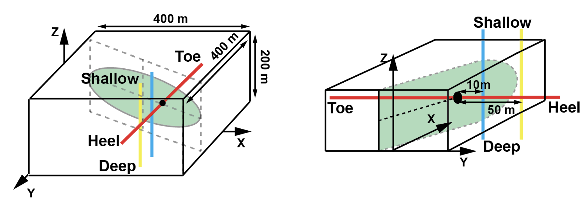
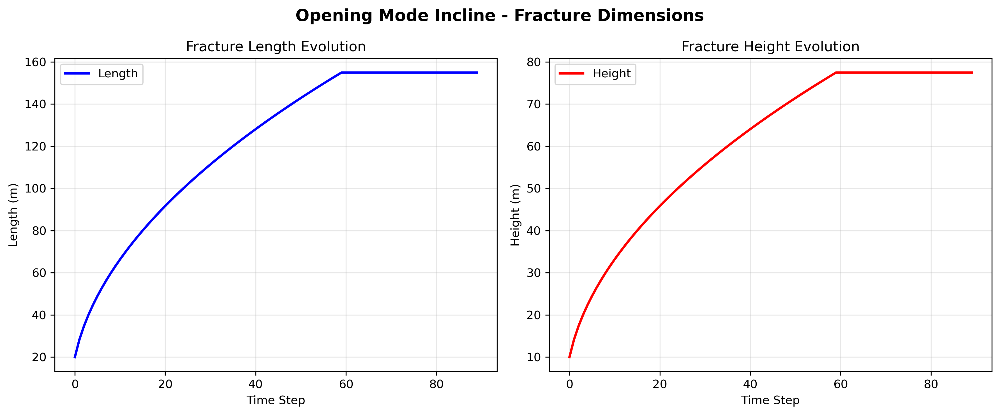
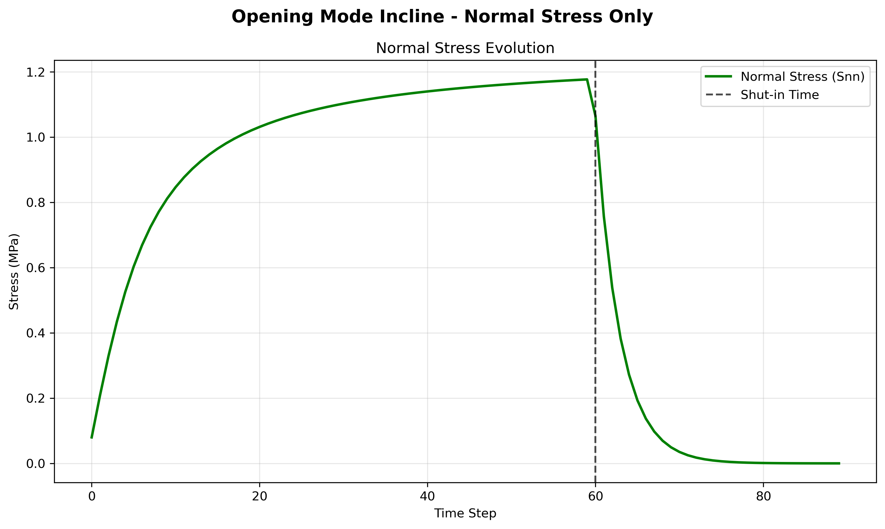

# Opening Mode Incline Example

This example demonstrates the **opening mode with inclination** - a fracture inclined at -30 degrees that grows over time with only normal stress (opening mode) and no shear stress.

## Overview

- **Fracture Orientation**: -30 degrees (inclined)
- **Stress Mode**: Normal stress only (pure opening mode)
- **Fracture Center**: (0, -28.87, 0) - offset due to inclination
- **Time Steps**: 90 (60 before shut-in + 30 after shut-in)
- **Fracture Growth**: Square root growth pattern

## Parameters

### Fracture Geometry
- **Length Scale**: 20.0 m
- **Height Scale**: 10.0 m
- **Element Count**: 10 × 10 elements
- **Growth Pattern**: `length = 20 * sqrt(time)`, `height = 10 * sqrt(time)`
- **Inclination**: -30 degrees (o1 = -30°)

### Stress Profile
- **Normal Stress (Snn)**: 
  - Before shut-in: `0.8e6 * arctan(time)` (increasing)
  - After shut-in: Exponential decay
- **Shear Stress (Ssl, Ssh)**: 0 (pure opening mode)

### Material Properties
- **Shear Modulus**: 10 GPa
- **Poisson's Ratio**: 0.25

## Fiber Network

Three DAS fibers are deployed for monitoring:

1. **Fiber 1**: Across the fracture
   - Start: (50, 100, 0)
   - End: (50, -100, 0)
   - Channels: 200

2. **Fiber 2**: Parallel to fracture (close)
   - Start: (50, 10, -100)
   - End: (50, 10, 100)
   - Channels: 200

3. **Fiber 3**: Parallel to fracture (far)
   - Start: (50, 50, -100)
   - End: (50, 50, 100)
   - Channels: 200

## Fiber and Fracture Dimensions

The following figure illustrates the fracture and fiber configuration for the opening mode incline case.



- **Fracture Center**: (0, -28.87, 0)
- **Fracture Orientation**: o1=-30°, o2=0°, o3=0°
- **Block Dimensions**: 400m × 400m × 200m
- **Fiber Layout**: Three fibers positioned to capture different aspects of the inclined fracture response

## Usage

### Basic Usage
```bash
python run_opening_mode_incline.py
```

### With Custom Parameters
```bash
# Force recalculation
python run_opening_mode_incline.py --recalculate

# Custom gauge length for interpolation
python run_opening_mode_incline.py --gauge_length 5.0

# Both options
python run_opening_mode_incline.py --recalculate --gauge_length 5.0
```

### Command Line Options
- `--recalculate` or `-r`: Force recalculation instead of loading from HDF5 files
- `--gauge_length` or `-gl`: Channel spacing for interpolation (default: 10.0 meters)
- `--scale` or `-s`: Scale factor for the data for plotting (default: 20.0)

## Output

The script generates:

### HDF5 Files
- `./results/opening_mode_incline/opening_mode_incline_fiber_1.h5`
- `./results/opening_mode_incline/opening_mode_incline_fiber_2.h5`
- `./results/opening_mode_incline/opening_mode_incline_fiber_3.h5`

### Plots
- `./results/opening_mode_incline/opening_mode_incline_fiber_1_EYY_U.png` - Strain contour
- `./results/opening_mode_incline/opening_mode_incline_fiber_1_EYY_U_Rate.png` - Strain rate contour

## Fracture Geometry Evolution and Stress Profiles

The simulation uses synthetic geometry evolution and stress profiles derived from pure mathematic approximations, which mimics the real-world cases. The code is capable and the users are encouraged to use physics-based fracture geometry and stress evolution data. The following plots show the fracture geometry and stress evolution for the opening mode incline case:

### Fracture Dimensions Evolution



**Fracture Geometry Characteristics:**
- **Length**: Square root growth from 0 to ~20m over 60 time steps, then constant
- **Height**: Square root growth from 0 to ~10m over 60 time steps, then constant
- **Growth Pattern**: Highest growth rate at early times, decreasing as fracture grows
- **Inclination Effect**: Same growth pattern as base case, but with -30° orientation in o1, o2, o3

### Normal Stress Evolution



**Stress Characteristics:**
- **Normal Stress (Snn)**: 
  - Increases with arctangent function during growth phase (0-60 time steps (minutes in this simulation), the code does not enforce the unit of time steps)
  - Exponential decay after shut-in (60-90 time steps)
  - Peak stress at shut-in time
- **Shear Stresses**: Zero throughout (pure opening mode)
- **Inclination Effect**: Stress field is asymmetric due to -30° fracture orientation

## Expected Results

### Fracture Behavior
- **Pure Opening**: No shear displacement, only normal opening
- **Asymmetric Growth**: Fracture grows with inclination, creating asymmetric stress field
- **Stress Evolution**: Normal stress increases during growth, then decays after shut-in

### DAS Response
- **Fiber 1** (across fracture): Strong response with asymmetric pattern due to inclination
- **Fiber 2** (close parallel): Moderate response, affected by inclined geometry
- **Fiber 3** (far parallel): Weak response, less affected by inclination

### Time-Space Patterns
- **Strain**: Positive values during opening, negative during closing
- **Strain Rate**: High rates during active growth, low rates during stable periods
- **Spatial Distribution**: Asymmetric pattern due to fracture inclination

## Physical Interpretation

This example represents a **hydraulic fracture in an inclined formation** with:
- **Tectonic influence**: Fracture follows inclined bedding or fault plane
- **No faulting**: No shear components, pure hydraulic opening
- **Asymmetric growth**: Growth pattern influenced by inclination
- **Standard DAS monitoring**: Typical fiber deployment for inclined fracturing

## Comparison with Other Modes

- **vs. Opening Mode Base**: This has -30° inclination vs 0° (horizontal)
- **vs. Shear Mode**: This has no shear stress (opening vs pure shear)
- **vs. Mixed Mode**: This has only normal stress (opening vs opening+shear)

## Key Differences from Base Case

### Geometric Effects
- **Fracture Center Offset**: y = -28.87 m (due to -30° inclination)
- **Asymmetric Stress Field**: Stress distribution affected by inclination
- **Different Fiber Response**: Fibers experience different stress patterns

### DAS Response Characteristics
- **Asymmetric Strain Patterns**: Due to inclined fracture geometry
- **Modified Amplitude**: Different strain amplitudes compared to base case
- **Spatial Variation**: More complex spatial distribution of strain

## Troubleshooting

### Common Issues
1. **Memory Issues**: Reduce time steps or use smaller gauge_length
2. **File Not Found**: Ensure DDM3D package is properly installed
3. **Plot Errors**: Check matplotlib backend and display settings

### Performance Tips
- Use `--gauge_length` to control interpolation resolution
- Use HDF5 files for repeated runs (don't use `--recalculate`)
- Monitor memory usage for large simulations

## Scientific Applications

This example is particularly relevant for:
- **Inclined Bedding**: Hydraulic fracturing in dipping formations
- **Fault-Related Fractures**: Fractures following fault planes
- **Tilted Reservoirs**: Fracturing in tilted reservoir units
- **Geological Complexity**: Understanding fracture behavior in complex geology
