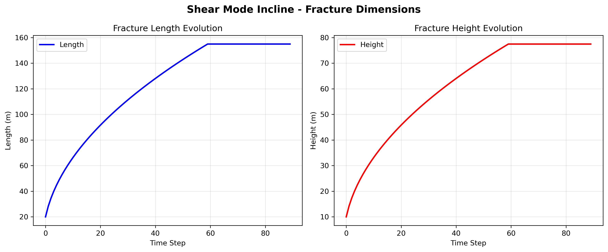
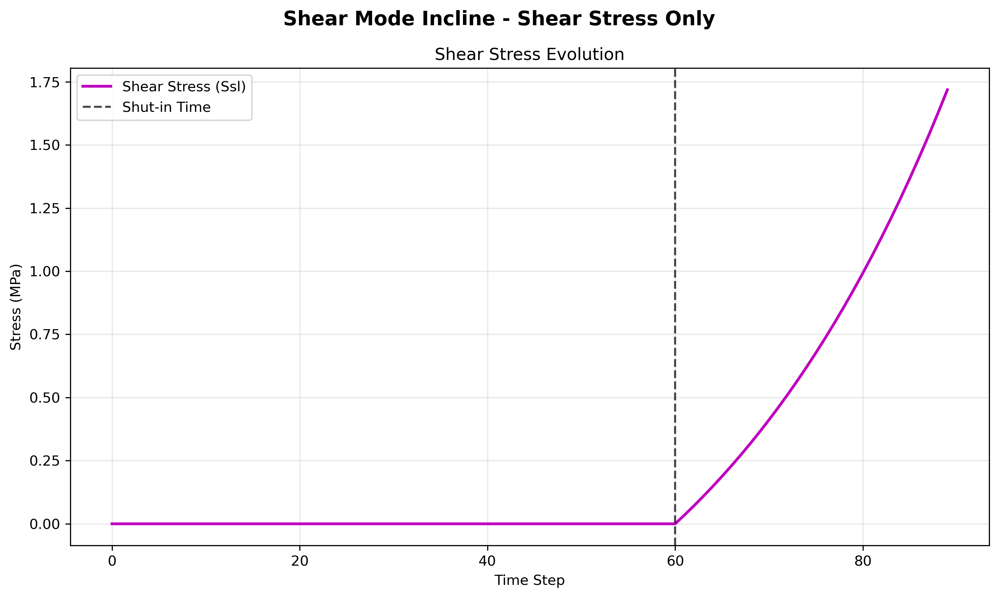

# Shear Mode Incline Example

This example demonstrates the **shear mode with inclination** - a fracture inclined at -30 degrees that experiences only shear stress (no normal stress), representing fault slip behavior.

## Overview

- **Fracture Orientation**: -30 degrees (inclined)
- **Stress Mode**: Shear stress only (pure fault slip)
- **Fracture Center**: (0, -28.87, 0) - offset due to inclination
- **Time Steps**: 90 (60 before shut-in + 30 after shut-in)
- **Fracture Growth**: Square root growth pattern

## Parameters

### Fracture Geometry
- **Length Scale**: 20.0 m
- **Height Scale**: 10.0 m
- **Element Count**: 10 × 10 elements
- **Growth Pattern**: `length = 20 * sqrt(time)`, `height = 10 * sqrt(time)`
- **Inclination**: -30 degrees (o1 = -30°)

### Stress Profile
- **Shear Stress (Ssl)**: 
  - Before shut-in: 0 (no slip)
  - After shut-in: `-1.0e6 * exp(0.01 * time) + 1.0e6` (increasing slip)
- **Normal Stress (Snn)**: 0 (no opening/closing)
- **Shear Stress (Ssh)**: 0 (no out-of-plane shear)

### Material Properties
- **Shear Modulus**: 10 GPa
- **Poisson's Ratio**: 0.25

## Fiber Network

Three DAS fibers are deployed for monitoring:

1. **Fiber 1**: Across the fracture
   - Start: (50, 100, 0)
   - End: (50, -100, 0)
   - Channels: 200

2. **Fiber 2**: Parallel to fracture (close)
   - Start: (50, 10, -100)
   - End: (50, 10, 100)
   - Channels: 200

3. **Fiber 3**: Parallel to fracture (far)
   - Start: (50, 50, -100)
   - End: (50, 50, 100)
   - Channels: 200

## Fiber and Fracture Dimensions

The following figure illustrates the fracture and fiber configuration for the shear mode incline case.


- **Fracture Center**: (0, -28.87, 0)
- **Fracture Orientation**: o1=-30°, o2=0°, o3=0°
- **Block Dimensions**: 400m × 400m × 200m
- **Fiber Layout**: Three fibers positioned to capture different aspects of the inclined fracture response

## Usage

### Basic Usage
```bash
python run_shear_mode_incline.py
```

### With Custom Parameters
```bash
# Force recalculation
python run_shear_mode_incline.py --recalculate

# Custom gauge length for interpolation
python run_shear_mode_incline.py --gauge_length 5.0

# Both options
python run_shear_mode_incline.py --recalculate --gauge_length 5.0
```

### Command Line Options
- `--recalculate` or `-r`: Force recalculation instead of loading from HDF5 files
- `--gauge_length` or `-gl`: Channel spacing for interpolation (default: 10.0 meters)
- `--scale` or `-s`: Scale factor for the data for plotting (default: 20.0)

## Output

The script generates:

### HDF5 Files
- `./results/shear_mode_incline/shear_mode_incline_fiber_1.h5`
- `./results/shear_mode_incline/shear_mode_incline_fiber_2.h5`
- `./results/shear_mode_incline/shear_mode_incline_fiber_3.h5`

### Plots
- `./results/shear_mode_incline/shear_mode_incline_fiber_1_EYY_U.png` - Strain contour
- `./results/shear_mode_incline/shear_mode_incline_fiber_1_EYY_U_Rate.png` - Strain rate contour

## Fracture Geometry Evolution and Stress Profiles

The simulation uses synthetic geometry evolution and stress profiles derived from pure mathematic approximations, which mimics the real-world cases. The code is capable and the users are encouraged to use physics-based fracture geometry and stress evolution data. The following plots show the fracture geometry and stress evolution for the shear mode incline case:

### Fracture Dimensions Evolution



**Fracture Geometry Characteristics:**
- **Length**: Square root growth from 0 to ~20m over 60 time steps, then constant
- **Height**: Square root growth from 0 to ~10m over 60 time steps, then constant
- **Growth Pattern**: Highest growth rate at early times, decreasing as fracture grows
- **Inclination Effect**: Same growth pattern as base case, but with -30° orientation in o1, o2, o3

### Shear Stress Evolution



**Stress Characteristics:**
- **Normal Stress (Snn)**: Zero throughout (no opening/closing)
- **Shear Stress (Ssl)**: 
  - Zero during growth phase (0-60 time steps (minutes in this simulation), the code does not enforce the unit of time steps)
  - Exponential increase after shut-in (60-90 time steps)
  - Represents fault slip activation
- **Shear Stress (Ssh)**: Zero throughout (no out-of-plane shear)
- **Fault Slip Signature**: Distinctive stress pattern for fault activation

## Expected Results

### Fracture Behavior
- **Pure Shear Slip**: No opening/closing, only shear displacement
- **Fault Slip Pattern**: Represents natural fault slip behavior
- **Asymmetric Growth**: Fracture grows with inclination, creating asymmetric stress field
- **Stress Evolution**: Shear stress increases after shut-in, representing fault activation

### DAS Response
- **Fiber 1** (across fracture): Strong response with asymmetric pattern due to shear slip
- **Fiber 2** (close parallel): Moderate response, affected by shear displacement
- **Fiber 3** (far parallel): Weak response, less affected by shear slip

### Time-Space Patterns
- **Strain**: Complex patterns due to shear displacement
- **Strain Rate**: High rates during fault slip activation
- **Spatial Distribution**: Asymmetric pattern due to fracture inclination and shear slip

## Physical Interpretation

This example represents a **fault slip event** with:
- **Tectonic Stress**: Shear stress buildup and release
- **Fault Plane**: Inclined fracture representing fault geometry
- **No Opening**: Pure shear displacement, no hydraulic fracturing
- **Natural Faulting**: Represents natural earthquake or fault slip

## Comparison with Other Modes

- **vs. Opening Mode Base**: This has shear stress vs normal stress
- **vs. Opening Mode Incline**: This has shear stress vs normal stress (both inclined)
- **vs. Mixed Mode**: This has only shear stress vs both shear and normal stress

## Key Characteristics

### Shear Slip Behavior
- **No Opening**: Fracture doesn't open or close
- **Pure Slip**: Only shear displacement along fracture plane
- **Fault Activation**: Shear stress increases after shut-in
- **Asymmetric Response**: Due to inclined geometry

### DAS Response Characteristics
- **Shear-Induced Strain**: Strain patterns due to shear displacement
- **Asymmetric Patterns**: Due to inclined fracture geometry
- **Fault Slip Signature**: Distinctive strain patterns for fault slip
- **Spatial Complexity**: More complex spatial distribution than opening modes

## Scientific Applications

This example is particularly relevant for:
- **Fault Monitoring**: Monitoring fault slip using DAS
- **Earthquake Studies**: Understanding fault slip behavior
- **Induced Seismicity**: Monitoring induced fault slip
- **Tectonic Studies**: Understanding fault mechanics
- **Seismic Hazard**: Assessing fault slip potential

## Geological Context

### Fault Types
- **Strike-Slip Faults**: Horizontal displacement along fault plane
- **Dip-Slip Faults**: Vertical displacement along inclined fault plane
- **Oblique-Slip Faults**: Combination of strike-slip and dip-slip

### Monitoring Applications
- **Fault Zone Monitoring**: Continuous monitoring of fault activity
- **Earthquake Early Warning**: Detecting fault slip initiation
- **Induced Seismicity**: Monitoring human-induced fault activation
- **Tectonic Studies**: Understanding regional fault behavior

## Troubleshooting

### Common Issues
1. **Memory Issues**: Reduce time steps or use smaller gauge_length
2. **File Not Found**: Ensure DDM3D package is properly installed
3. **Plot Errors**: Check matplotlib backend and display settings

### Performance Tips
- Use `--gauge_length` to control interpolation resolution
- Use HDF5 files for repeated runs (don't use `--recalculate`)
- Monitor memory usage for large simulations

## Advanced Analysis

### Strain Pattern Analysis
- **Shear Strain Components**: Analyze different strain components
- **Spatial Gradients**: Study strain gradients around fault
- **Temporal Evolution**: Monitor strain evolution over time
- **Fault Geometry Effects**: Understand influence of fault inclination

### Comparison Studies
- **vs. Opening Modes**: Compare shear vs opening behavior
- **vs. Mixed Modes**: Compare pure shear vs combined modes
- **Different Inclinations**: Study effect of fault dip angle
- **Different Stress Levels**: Study effect of stress magnitude
